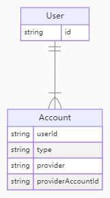

## 一起干翻next-auth@5.0系列(三): 数据库集成授权登录

好吧，终于来到了数据库环节了，为了让我们的教程更加简单，我们这次集成`prisma+sqlite`作为数据库。
简单介绍一下这俩货：

1. `prisma`： 一个开源的数据库ORM，可以用来快速、安全地构建数据库。
2. `sqlite`： 一个基于文件的轻量级的关系型数据库，可以嵌入到应用中，用于开发和测试(**好处就是不用再安装数据库服务**)

## 思路

这次我们不那么简单的上来就讲代码了，我们梳理一下相关的思路，然后一步步实现。

### 1. 多渠道的第三方账号如何绑定到自己的账号系统

- 我们可以区分用户(`User`)和账户(`Account`)。
- 一个用户可以拥有多个账户。
- 用户首次通过某个提供商类型(`Provder`)登录时，会为其创建一个账户。
- 例如，若用户先通过 Google 登录，随后又通过 Facebook 登录，则将拥有两个账户，分别对应每个提供商。

用户创建策略：
- 用户首次登录的提供商也将用于创建用户对象。参见 profile() 提供商方法。

